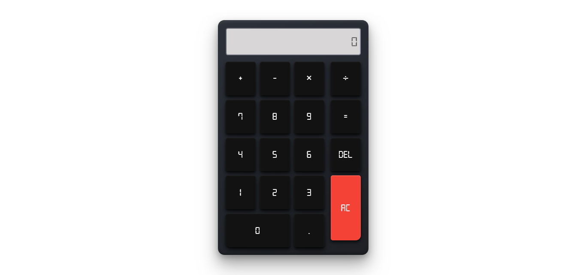

# Calculator-TOP

This project is part of the foundations course on [The Odin Project](https://www.theodinproject.com/lessons/foundations-calculator).

## Overview

### The challenge

- Build out a working calculator, that performs simple operations.

### Live site
[**Try It Now**](https://3kori.github.io/calculator-TOP/)

## My process

### Built with

- Semantic HTML5 markup
- CSS custom properties
- Flexbox
- Javascript

### What I learned

The use of basic HTML, CSS, and JS concepts.

### Continued development

I will continue to add more features in the future.
